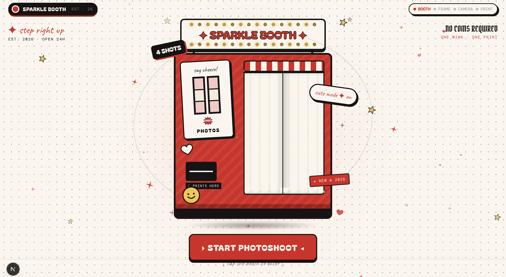

# Snap Cut Photo Booth Web App

A web-based photobooth application built with **Next.js** and **React**. This app allows users to enjoy a seamless photobooth experience directly from their browser, complete with custom layouts, creative themes, and instant image downloads.

## Features

- **Interactive Camera:** Real-time camera feed with an automatic countdown timer. Includes a mock stream fallback if a physical camera is unavailable or access is denied.
- **Multiple Layouts:** Choose from a variety of photo arrangements:
  - `4 Action` (Vertical 4-photo strip)
  - `4 Grid` (2x2 photo grid)
  - `Single` (One large photo)
  - `Double` (Vertical 2-photo strip)
- **Custom Themes:** Creative frames powered by custom Canvas rendering:
  - **Basic:** Minimalist white background.
  - **Dark:** Classic black background.
  - **Receipt:** Simulates a modern store receipt complete with "nutrition facts" of happiness and barcodes.
  - **Vintage Ticket:** Simulates a retro movie ticket featuring side notches, dashed lines, and a vintage camera icon.
- **Export & Download:** Automatically combines captured photos onto a styled canvas, ready for instant download and sharing.

## Tech Stack

- **Framework:** [Next.js](https://nextjs.org/) (App Router)
- **Library:** [React](https://reactjs.org/)
- **Styling:** [Tailwind CSS](https://tailwindcss.com/)
- **UI Components:** [shadcn/ui](https://ui.shadcn.com/) (partial implementation) and Lucide Icons
- **Image Processing:** HTML5 Canvas API for drawing images, generating barcodes, and rendering complex ticket/receipt layouts.

## Getting Started

1. **Clone the repository**
   ```bash
   git clone <your-repo-url>
   cd photoboothdober

